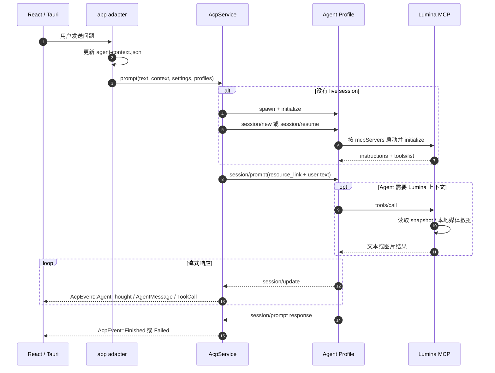

# lumina-acp

`lumina-acp` 是 Lumina 的通用 Agent Client Protocol（ACP）客户端库。它通过
`stdio JSON-RPC 2.0` 与本机 Agent 子进程（如默认的 Codex ACP 适配器、Claude
Code 或自定义 Agent）通信，负责会话生命周期、流式事件、权限请求、取消和错误
边界。

它是可选能力：没有配置 Agent 时，播放、字幕和笔记功能仍然可以独立运行。

---

## 1. 模块定位与职责

在 Lumina 架构中，`lumina-acp` 确立了应用与 AI 智能体之间的**稳定开放协议边界**：

```text
[React 前端 / Chat 对话面板]
        │ (Tauri Commands / Events)
        ▼
   [lumina-acp] (标准 ACP Client)
        │
        │ (跨平台 stdio JSON-RPC 管道)
        ▼
   [Agent Profile 子进程] (如 codex-acp / 自定义 Agent)
        │
        ▼
   [Codex App Server / 模型后端] (如 Responses API)

   [AppSessionEnvironment]
        ├─ session/new|resume 的 MCP 配置
        ├─ Lumina snapshot 路径与能力同步
        └─ Chat / isolated 任务工具权限隔离
```

- **职责**：
  - 维持纯客户端（Client-only）身份：绝不把特定供应商私有 API（如 Codex 私有协议）作为主协议，只面向标准通用的 ACP 编程。
  - 按需启动与子进程托管（Process Lifecycle）：用户发起交互时才 spawn 对应 Agent Profile；提供会话初始化（`initialize`）、认证（`authenticate`）和会话建立（`session/new`）。
  - 双向 RPC 调度：
    - **Client → Agent**：`session/prompt`、`session/cancel`、`session/set_config_option`。
    - **Agent → Client**：处理来自 Agent 的权限请求、终端/文件系统请求、工具进度和其他 session update。
  - 流式文本与思考过程解析（`agent_reply_collector`）：增量还原 Agent 的推理思考（Thinking / Reasoning 块）与最终回答。
  - 动态视频上下文打包（`context`）：每轮只传递媒体 `resource_link`；播放锚点、章节、笔记和媒体库状态写入 snapshot，由 MCP 工具按需读取。稳定工具说明由 MCP 初始化阶段提供，不重复注入每轮 prompt。
  - 会话环境抽象（`SessionEnvironment`）：`lumina-acp` 不直接依赖 Lumina 的 MCP、媒体库或快照实现，由宿主应用提供路径、能力和 MCP server 配置。
  - 普通聊天与隔离任务分离：聊天可以使用历史和 Lumina MCP；翻译/元数据解析等短任务使用无历史、无工具的受限 session。
- **硬约束**：
   - 未配置 Agent（如初次使用、无 API Key）时，必须返回 `NotConfigured`，播放/字幕/笔记功能**绝对不能因此受到任何影响**。
  - `message` 是稳定的业务提示；底层 stderr、serde、路径和协议细节只进入 `details` 与日志。
  - 严防终端僵尸进程：设置明确的超时与取消保护（`CANCEL_KILL_SECS`），Agent 超时不响应取消则强制终止。

---

## 2. 构建思路与设计原则

1. **协议层与 Agent 引擎解耦**：
   - 换模型 ≠ 换 Agent。模型/推理选项通过 session 配置调整；切换 Codex、Claude 或自定义 Agent，则由 profile 的启动命令和参数决定。
2. **权限模式由宿主应用控制**：
   - `PermissionMode::Auto` 自动处理可放行请求；`PermissionMode::Ask` 通过 UI 请求用户确认。隔离任务不开放 Lumina MCP 工具。
3. **环境隔离与工作空间自适应**：
   - 本地媒体通常使用媒体目录作为 `cwd`；在线 URL 不直接作为 Windows 工作目录，而是回退到受保护的 App-Data workspace。
4. **缓存友好的上下文边界**：
   - 固定工具说明由 MCP `initialize.result.instructions` 提供；每轮 prompt 只携带媒体链接、历史摘要和用户输入，动态播放数据放在 snapshot 中按需读取。

---

## 3. 对外使用指南

### 添加依赖

```toml
[dependencies]
lumina-acp = { path = "../lumina-acp" }
```

### 代码使用示例

`AcpService::prompt` 的参数较多，是因为它同时接收工作目录、Profile、会话恢复、
客户端设置和事件回调。真实应用通常由 Tauri command / app adapter 组装这些参数。

#### 1. 查看 Agent 状态

```rust
use lumina_acp::{AcpService, AgentProfilesHint};

let acp = AcpService::new();
let profiles: AgentProfilesHint = load_profiles_from_app_settings();
let status = acp.status(&profiles);

println!("当前 Profile: {}", status.active_profile_id);
println!("Agent 可用: {}", status.available);
```

#### 2. 发起普通聊天并接收事件

```rust
use lumina_acp::{
    AcpClientSettings, AcpEvent, AcpService, AgentProfilesHint, VideoPromptContext,
};

let acp = AcpService::new();
let profiles: AgentProfilesHint = load_profiles_from_app_settings();

let context = VideoPromptContext {
    media_path: Some(r"D:\videos\demo.mp4".into()),
    media_title: Some("demo.mp4".into()),
    position_ms: Some(45_000),
    duration_ms: None,
    chapter_title: None,
    subtitle_choice_id: Some("embedded:0".into()),
    notes_excerpt: None,
};

let answer = acp.prompt(
    "解释一下刚才提到的内容。",
    Some(r"D:\videos\demo.mp4".into()),
    Some("codex".into()),
    Some(context),
    None, // history_context；需要时传入稳定摘要
    None, // saved_session；需要恢复会话时传入
    AcpClientSettings::default(),
    profiles,
    |event| match event {
        AcpEvent::AgentThought { text } => println!("[思考] {text}"),
        AcpEvent::AgentMessage { text } => println!("[消息] {text}"),
        AcpEvent::Finished { .. } => println!("--- 回答完毕 ---"),
        AcpEvent::Failed { code, message } => eprintln!("{code}: {message}"),
        _ => {}
    },
)?;

println!("最终答案：{answer}");
```

上例中的 `load_profiles_from_app_settings()` 是宿主应用自己的配置读取函数，
不是 `lumina-acp` 提供的 API。

#### 3. 隔离任务

翻译、元数据解析等短任务使用：

```rust
let result = AcpService::prompt_isolated_restricted(
    task_prompt,
    "codex".into(),
    profiles,
    model_selection,
    Some("library:resolver".into()), // 仅日志追踪，不会发送给模型
)?;
```

该路径会创建短生命周期 session，不复用聊天历史，不传入视频上下文，也不开放
Lumina MCP 工具。无有效文本返回时会得到 `AcpErrorCode::NoOutput`，而不是一段
可被误解析为模型结果的提示文本。

---

## 4. 内部子模块全景

`lumina-acp/src/` 的主要实现模块如下；列表聚焦稳定的核心文件，内部辅助文件可随实现调整：

| 源码文件 | 模块名称 | 核心职责与导出项 |
| :--- | :--- | :--- |
| [`lib.rs`](./lib.rs) | 根模块 | 重新导出公开接口；定义协议约束。 |
| [`service.rs`](./service.rs) | `service` | • `AcpService`: 统筹连接、`session/new|resume`、聊天 prompt、隔离任务、模型切换、取消和关闭。 |
| [`protocol.rs`](./protocol.rs) | `protocol` | ACP JSON-RPC 请求/响应形状：`initialize`、`session/new|resume`、`session/prompt`、权限响应和 session 配置。 |
| [`profile.rs`](./profile.rs) | `profile` | • `AgentProfile`: 描述 Agent 启动配置（命令、参数、环境变量、Profile 类型）。 |
| [`host.rs`](./host.rs) | `host` | • `AcpHost`: 处理 Agent 反向发起的系统级请求（如终端执行、权限放行审批）。 |
| [`agent_reply_collector.rs`](./agent_reply_collector.rs) | `collector` | 流式事件收集器，平滑拼装散落的推理思考片段（Thinking）与正文回答（Text）。 |
| [`context.rs`](./context.rs) | `context` | • `VideoPromptContext`: 构造每轮媒体 `resource_link`；不内联 snapshot JSON 或台词正文。 |
| [`environment.rs`](./environment.rs) | `environment` | • `SessionEnvironment`: 由宿主注入 snapshot 路径、能力同步和 Chat/isolated MCP 配置。 |
| [`settings.rs`](./settings.rs) | `settings` | • `AcpClientSettings`, `PermissionMode`, `ThinkingLevel`；可选模型和 reasoning 选择。 |
| [`discover.rs`](./discover.rs) | `discover` | 查找 ACP/Codex 命令、安装目录和配置目录；模型发现请求由 `service` 发起。 |
| [`paths.rs`](./paths.rs) | `paths` | 解析工作区目录 `cwd`，对在线 URL 媒体做安全 workspace 回退。 |
| [`process.rs`](./process.rs) | `process` | 跨平台启动和终止 Agent 子进程；该模块为 crate 内部实现，不是公开 API。 |
| [`model.rs`](./model.rs) | `model` | 领域 DTO：`AcpEvent`, `AcpStatus`, `PermissionOption`, `SavedSessionHint` 等。 |
| [`error.rs`](./error.rs) | `error` | • `AcpError` 与 `AcpErrorCode`（`NotConfigured`, `Busy`, `WorkspaceUnavailable`, `SpawnFailed`, `NoOutput`, `Cancelled` 等）。 |

---

## 5. 核心协作与数据流向

### 普通聊天



关键点：`lumina-acp` 是 ACP Client，不直接执行 Lumina MCP 工具；MCP 工具由
Agent 根据 `tools/list` 自己调用。应用适配器负责写 snapshot，ACP 只负责把宿主
提供的 MCP 配置接入 `session/new|resume`。

### 隔离任务

```text
AgentInvoker
  → AcpAgentInvoker
  → AcpService::prompt_isolated_restricted
  → 新的 Agent 进程和 session
  → NoTools MCP profile / 无聊天历史 / 无视频上下文
  → 返回一次性文本或 NoOutput
  → 业务层映射为翻译、元数据解析等固定错误
```

### 生命周期与错误

- `connect`：预热 Agent 和 session，不发送用户问题。
- `prompt`：复用 live session，发送一次 `session/prompt` 并收集流式事件。
- `new_chat`：关闭或旋转当前 session，开始新的聊天上下文。
- `request_cancel`：请求取消当前 prompt；超时后由 ACP 层终止子进程。
- `close_session`：结束 session 并清理 Agent 子进程。
- `AcpError` 使用 `{ code, message, details? }`；UI 只展示稳定的 `message`。
