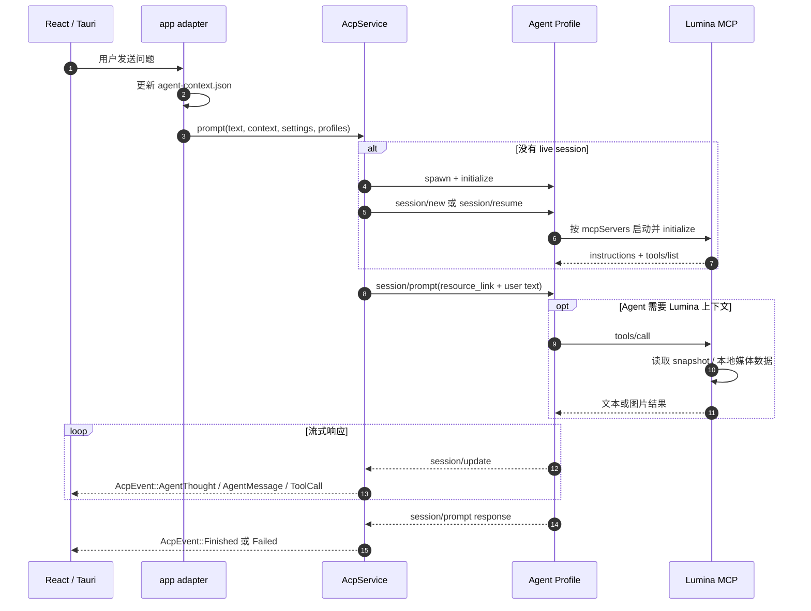

# lumina-acp

`lumina-acp` 是 Lumina 的通用 Agent Client Protocol（ACP）客户端库。它通过
`stdio JSON-RPC 2.0` 与本机 Agent 子进程（如默认的 Codex ACP 适配器、Claude
Code 或自定义 Agent）通信，负责会话生命周期、流式事件、权限请求、取消和错误
边界。

它是可选能力：没有配置 Agent 时，播放、字幕和笔记功能仍然可以独立运行。

---

## 1. 模块定位与职责

在 Lumina 架构中，`lumina-acp` 确立了应用与 AI 智能体之间的**稳定开放协议边界**：

```text
[React 前端 / Chat 对话面板]
        │ (Tauri Commands / Events)
        ▼
   [lumina-acp] (标准 ACP Client)
        │
        │ (跨平台 stdio JSON-RPC 管道)
        ▼
   [Agent Profile 子进程] (如 codex-acp / 自定义 Agent)
        │
        ▼
   [Codex App Server / 模型后端] (如 Responses API)

   [AppSessionEnvironment]
        ├─ session/new|resume 的 MCP 配置
        ├─ Lumina snapshot 路径与能力同步
        └─ Chat / isolated 任务工具权限隔离
```

- **职责**：
  - 维持纯客户端（Client-only）身份：绝不把特定供应商私有 API（如 Codex 私有协议）作为主协议，只面向标准通用的 ACP 编程。
  - 按需启动与子进程托管（Process Lifecycle）：用户发起交互时才 spawn 对应 Agent Profile；提供会话初始化（`initialize`）、认证（`authenticate`）和会话建立（`session/new`）。
  - 双向 RPC 调度：
    - **Client → Agent**：`session/prompt`、`session/cancel`、`session/set_config_option`。
    - **Agent → Client**：处理来自 Agent 的权限请求、终端/文件系统请求、工具进度和其他 session update。
  - 流式文本与思考过程解析（`agent_reply_collector`）：增量还原 Agent 的推理思考（Thinking / Reasoning 块）与最终回答。
  - 动态视频上下文打包（`context`）：每轮只传递媒体 `resource_link`；播放锚点、章节、笔记和媒体库状态写入 snapshot，由 MCP 工具按需读取。稳定工具说明由 MCP 初始化阶段提供，不重复注入每轮 prompt。
  - 会话环境抽象（`SessionEnvironment`）：`lumina-acp` 不直接依赖 Lumina 的 MCP、媒体库或快照实现，由宿主应用提供路径、能力和 MCP server 配置。
  - 普通聊天与隔离任务分离：聊天可以使用历史和 Lumina MCP；翻译/元数据解析等短任务使用无历史、无工具的受限 session。字幕翻译/校对由宿主按作业创建 `WorkshopPool`，复用隔离 session 槽位，作业结束后统一关闭。
- **硬约束**：
   - 未配置 Agent（如初次使用、无 API Key）时，必须返回 `NotConfigured`，播放/字幕/笔记功能**绝对不能因此受到任何影响**。
  - `message` 是稳定的业务提示；底层 stderr、serde、路径和协议细节只进入 `details` 与日志。
  - 严防终端僵尸进程：设置明确的超时与取消保护（`CANCEL_KILL_SECS`），Agent 超时不响应取消则强制终止。

---

## 2. 构建思路与设计原则

1. **协议层与 Agent 引擎解耦**：
   - 换模型 ≠ 换 Agent。模型/推理选项通过 session 配置调整；切换 Codex、Claude 或自定义 Agent，则由 profile 的启动命令和参数决定。
2. **权限模式由宿主应用控制**：
   - `PermissionMode::Auto` 自动处理可放行请求；`PermissionMode::Ask` 通过 UI 请求用户确认。隔离任务不开放 Lumina MCP 工具。
3. **环境隔离与工作空间自适应**：
   - 本地媒体通常使用媒体目录作为 `cwd`；在线 URL 不直接作为 Windows 工作目录，而是回退到受保护的 App-Data workspace。
4. **缓存友好的上下文边界**：
   - 固定工具说明由 MCP `initialize.result.instructions` 提供；每轮 prompt 只携带媒体链接、历史摘要和用户输入，动态播放数据放在 snapshot 中按需读取。

---

## 3. 对外使用指南

### 在 Cargo workspace 中添加依赖

```toml
[dependencies]
lumina-acp.workspace = true
```

### 代码使用示例

`AcpService::prompt` 的参数较多，是因为它同时接收工作目录、Profile、会话恢复、
客户端设置和事件回调。真实应用通常由 Tauri command / app adapter 组装这些参数。

#### 1. 查看 Agent 状态

```rust
use lumina_acp::{AcpService, AgentProfilesHint};

let acp = AcpService::new();
let profiles: AgentProfilesHint = load_profiles_from_app_settings();
let status = acp.status(&profiles);

println!("当前 Profile: {}", status.active_profile_id);
println!("Agent 可用: {}", status.available);
```

#### 2. 发起普通聊天并接收事件

```rust
use lumina_acp::{
    AcpClientSettings, AcpEvent, AcpService, AgentProfilesHint, VideoPromptContext,
};

let acp = AcpService::new();
let profiles: AgentProfilesHint = load_profiles_from_app_settings();

let context = VideoPromptContext {
    media_path: Some(r"D:\videos\demo.mp4".into()),
    media_title: Some("demo.mp4".into()),
    position_ms: Some(45_000),
    duration_ms: None,
    chapter_title: None,
    subtitle_choice_id: Some("embedded:0".into()),
    notes_excerpt: None,
};

let answer = acp.prompt(
    "解释一下刚才提到的内容。",
    Some(r"D:\videos\demo.mp4".into()),
    Some("codex".into()),
    Some(context),
    None, // history_context；需要时传入稳定摘要
    None, // saved_session；需要恢复会话时传入
    AcpClientSettings::default(),
    profiles,
    |event| match event {
        AcpEvent::AgentThought { text } => println!("[思考] {text}"),
        AcpEvent::AgentMessage { text } => println!("[消息] {text}"),
        AcpEvent::Finished { .. } => println!("--- 回答完毕 ---"),
        AcpEvent::Failed { code, message } => eprintln!("{code}: {message}"),
        _ => {}
    },
)?;

println!("最终答案：{answer}");
```

上例中的 `load_profiles_from_app_settings()` 是宿主应用自己的配置读取函数，
不是 `lumina-acp` 提供的 API。

#### 3. 隔离任务

翻译、元数据解析等短任务使用：

```rust
let result = AcpService::prompt_isolated_restricted(
    task_prompt,
    "codex".into(),
    profiles,
    model_selection,
    Some("library:resolver".into()), // 仅日志追踪，不会发送给模型
)?;
```

该路径会创建短生命周期 session，不复用聊天历史，不传入视频上下文，也不开放
Lumina MCP 工具。无有效文本返回时会得到 `AcpErrorCode::NoOutput`，而不是一段
可被误解析为模型结果的提示文本。

#### 4. 字幕工作台的 `WorkshopPool`

字幕翻译和校对不是每个批次都重新启动一个 Agent。宿主应用会为一次工作创建
一个作业级 `WorkshopPool`：默认 4 个槽位，每个槽位复用一个无工具、无聊天历史的
隔离 session；传输层失败最多进行一次相同请求重试，作业完成或失败后显式关闭 pool。
`submit` 是阻塞调用，应放在 `spawn_blocking` 等阻塞线程中执行。

```rust
use lumina_acp::{AgentProfilesHint, PoolConfig, WorkshopPool};

let pool = WorkshopPool::new(
    PoolConfig::new("codex", profiles),
    "subtitle-job-123".into(),
);
let translated = pool.submit(prompt, Some("batch=1".into()), None)?;
pool.shutdown();
```

---

## 4. 内部子模块全景

`lumina-acp/src/` 按四层组织，依赖只许单向：`domain → agent → wire → runtime/jobs`
（`error` 为全 crate 契约，置顶层）。`lib.rs` 是唯一公开门面，旧平铺路径
（`service/protocol/profile/paths/...`）仅作兼容 re-export 保留，新代码一律走新层级：

| 目录 | 模块 | 核心职责与导出项 |
| :--- | :--- | :--- |
| [`lib.rs`](./lib.rs) + [`error.rs`](./error.rs) | 根 / 契约 | 根 re-export（`AcpService/AcpError/WorkshopPool/...`）；`AcpError/AcpErrorCode` 固定业务 `message`。 |
| `domain/` | 纯数据，无 IO | `model.rs`（`AcpEvent/AcpStatus/PermissionOption/...`）、`settings.rs`（`AcpClientSettings/PermissionMode/ThinkingLevel`）、`context.rs`（`VideoPromptContext` + `resource_link` 组装）、`environment.rs`（`SessionEnvironment` 宿主注入 port）。 |
| `agent/` | 启动前：找谁、在哪跑 | `discover.rs`（PATH/native 查找）、`workspace.rs`（`resolve_session_cwd` + 在线 URL 回退）、`launch.rs`（`LaunchSpec/resolve_launch` + builtin Codex）、`profile.rs`（`AgentProfile/prepare/resolve_active`）、`status.rs`（`status_from_profiles/install_hint` 合并旧 `paths` + `profile` 文案）。 |
| `wire/` | 线上格式，纯函数 | `codec.rs`（request/notification/envelope/`Inbound` 分类）、`session.rs`（initialize/auth/new/resume/prompt/close params + parse）、`updates.rs`（agent text/thought/tool/plan 提取）、`permission.rs`（权限 options/auto/selected）、`sanitize.rs`（路径脱敏/截断/底层错误改写）。 |
| `runtime/` | 活着的进程 | `service.rs`（瘦门面：connect/new_chat/prompt/close/cancel/status）、`lifecycle.rs`（`LiveSession` + spawn/new/resume/rotate）、`io.rs`（stdio 读写 + 按 id 等待）、`inbound.rs`（update/permission 分发）、`host/{mod,fs,terminal}.rs`（`AcpHost`：`fs/*` 与 `terminal/*` 已拆开）、`process.rs`（crate 内 spawn/kill，无控制台闪烁）。 |
| `jobs/` | 一次性任务 | `isolated.rs`（`prompt_isolated/discover_isolated` 新家）、`pool.rs`（`WorkshopPool/PoolConfig`，另有 `IsolatedSessionPool` 别名）、`rollout.rs`（本任务 Codex rollout 精确清扫）、`collector.rs`（`AgentReplyCollector`，拼装 thinking + 正文）。 |

---

## 5. 核心协作与数据流向

### 普通聊天



关键点：`lumina-acp` 是 ACP Client，不直接执行 Lumina MCP 工具；MCP 工具由
Agent 根据 `tools/list` 自己调用。应用适配器负责写 snapshot，ACP 只负责把宿主
提供的 MCP 配置接入 `session/new|resume`。

### 隔离任务

```text
AgentInvoker
  → AcpAgentInvoker
  → job-scoped WorkshopPool
  → 复用隔离 Agent 进程和 session 槽位
  → NoTools MCP profile / 无聊天历史 / 无视频上下文
  → 返回一次性文本或 NoOutput
  → 业务层映射为翻译、元数据解析等固定错误
```

### 生命周期与错误

- `connect`：预热 Agent 和 session，不发送用户问题。
- `prompt`：复用 live session，发送一次 `session/prompt` 并收集流式事件。
- `new_chat`：关闭或旋转当前 session，开始新的聊天上下文。
- `request_cancel`：请求取消当前 prompt；超时后由 ACP 层终止子进程。
- `close_session`：结束 session 并清理 Agent 子进程。
- `AcpError` 使用 `{ code, message, details? }`；UI 只展示稳定的 `message`。
