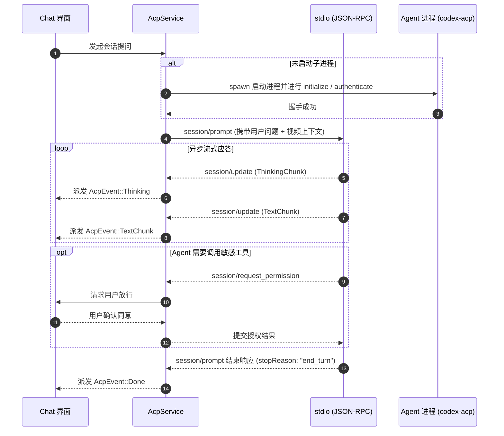

# lumina-acp

`lumina-acp` 是 Lumina 的通用 Agent 客户端协议（Agent Client Protocol，ACP）领域实现库。它通过 `stdio JSON-RPC 2.0` 双向通信管道，与本机 Agent 子进程（如默认的 Codex 适配器、Claude Code 等）建立标准化的长会话交互，提供流式推理打字机、权限确认与动态上下文注入能力。

---

## 1. 模块定位与职责

在 Lumina 架构中，`lumina-acp` 确立了应用与 AI 智能体之间的**稳定开放协议边界**：

```text
[React 前端 / Chat 对话面板]
        │ (Tauri Commands / Events)
        ▼
   [lumina-acp] (作为标准的 ACP Client)
        │
        │ (跨平台 stdio JSON-RPC 管道)
        ▼
   [Agent Profile 子进程] (如 codex-acp / 自定义 Agent)
        │
        ▼
   [Codex App Server / 模型后端] (如 Responses API)
```

- **职责**：
  - 维持纯客户端（Client-only）身份：绝不把特定供应商私有 API（如 Codex 私有协议）作为主协议，只面向标准通用的 ACP 编程。
  - 按需启动与子进程托管（Process Lifecycle）：用户发起交互时才 spawn 对应 Agent Profile；提供会话初始化（`initialize`）、认证（`authenticate`）和会话建立（`session/new`）。
  - 双向 RPC 调度：
    - **Client → Agent**：`session/prompt`、`session/cancel`、`session/set_config_option`。
    - **Agent → Client**：处理来自 Agent 的权限请求（`session/request_permission`）、工具调用通知及环境回调。
  - 流式文本与思考过程解析（`agent_reply_collector`）：增量还原 Agent 的推理思考（Thinking / Reasoning 块）与最终回答。
  - 动态视频上下文打包（`context`）：在用户提问时，将当前播放进度、周围字幕窗口及媒体元数据格式化注入到 System Prompt。
- **硬约束**：
  - 未配置 Agent（如初次使用、无 API Key）时，必须返回 `NotConfigured`，播放/字幕/笔记功能**绝对不能因此受到任何影响**。
  - 严防终端僵尸进程：设置明确的超时与取消保护（`CANCEL_KILL_SECS`），Agent 超时不响应取消则强制终止。

---

## 2. 构建思路与设计原则

1. **协议层与 Agent 引擎解耦**：
   - 换模型 ≠ 换 Agent：在配置中切换不同 Provider 是模型参数调整；而切换 Claude Code、Codex 或自研 Agent，仅仅是在 `profile.rs` 中替换启动命令与参数，领域逻辑完全不变。
2. **渐进式权限管控（Permission Mode）**：
   - `settings.rs` 支持 `Auto`（无感自动放行）、`Ask`（交互式弹出确认弹窗供用户勾选）以及 `Restricted` 模式，确保外部 Agent 调用本地系统命令或文件读写时的可控与安全。
3. **环境隔离与工作空间自适应（Session Environment）**：
   - 针对本地文件，Agent 的工作目录（`cwd`）定位在媒体所在文件夹；针对在线流媒体（URL），系统自动重定向至受保护的临时 App-Data 缓存空间，防止因非法路径导致 Agent 进程启动崩溃。

---

## 3. 对外使用指南

### 添加依赖

```toml
[dependencies]
lumina-acp = { path = "../lumina-acp" }
```

### 代码使用示例

#### 1. 检查 Agent 配置状态

```rust
use lumina_acp::AcpService;

let acp = AcpService::new();
let status = acp.status();

println!("当前默认 Profile: {:?}", status.current_profile_id);
println!("是否具备可用配置: {}", status.configured);
```

#### 2. 发起提示词交互并监听流式响应

```rust
use lumina_acp::{AcpService, VideoPromptContext};

let acp = AcpService::new();

// 构造当前播放场景上下文
let context = VideoPromptContext {
    media_title: "全面解析量子纠缠".into(),
    position_ms: 45_000,
    transcript_window: "当前讲解贝尔不等式检验实验...".into(),
};

// 提交提问并监听流式输出
acp.prompt_with_context(
    "解释一下刚才提到的贝尔不等式是什么意思？",
    Some(context),
    |event| {
        match event {
            lumina_acp::AcpEvent::Thinking(chunk) => print!("[思考] {chunk}"),
            lumina_acp::AcpEvent::TextChunk(chunk) => print!("{chunk}"),
            lumina_acp::AcpEvent::Done => println!("\n--- 回答完毕 ---"),
            _ => {}
        }
    },
)?;
```

---

## 4. 内部子模块全景

`lumina-acp/src/` 包含以下 13 个源码模块：

| 源码文件 | 模块名称 | 核心职责与导出项 |
| :--- | :--- | :--- |
| [`lib.rs`](file:///d:/project/rust/tauri/lumina/crates/lumina-acp/src/lib.rs) | 根模块 | 重新导出公开接口；定义协议约束。 |
| [`service.rs`](file:///d:/project/rust/tauri/lumina/crates/lumina-acp/src/service.rs) | `service` | • `AcpService`: 统筹会话建立、Prompt 循环、心跳检测与优雅取消。 |
| [`protocol.rs`](file:///d:/project/rust/tauri/lumina/crates/lumina-acp/src/protocol.rs) | `protocol` | 严格遵循 ACP 规范的 JSON-RPC 编解码器（初始化、通知、权限应答、错误序列化）。 |
| [`profile.rs`](file:///d:/project/rust/tauri/lumina/crates/lumina-acp/src/profile.rs) | `profile` | • `AgentProfile`: 描述 Agent 启动配置（命令、参数、环境变量、Profile 类型）。 |
| [`host.rs`](file:///d:/project/rust/tauri/lumina/crates/lumina-acp/src/host.rs) | `host` | • `AcpHost`: 处理 Agent 反向发起的系统级请求（如终端执行、权限放行审批）。 |
| [`agent_reply_collector.rs`](file:///d:/project/rust/tauri/lumina/crates/lumina-acp/src/agent_reply_collector.rs) | `collector` | 流式事件收集器，平滑拼装散落的推理思考片段（Thinking）与正文回答（Text）。 |
| [`context.rs`](file:///d:/project/rust/tauri/lumina/crates/lumina-acp/src/context.rs) | `context` | • `VideoPromptContext`: 格式化生成包含当前播放秒数、前后文台词的 System Prompt 注入块。 |
| [`environment.rs`](file:///d:/project/rust/tauri/lumina/crates/lumina-acp/src/environment.rs) | `environment` | 构建子进程启动所需的环境变量沙箱，注入 API Token 与自定义路径。 |
| [`settings.rs`](file:///d:/project/rust/tauri/lumina/crates/lumina-acp/src/settings.rs) | `settings` | • `AcpClientSettings`, `PermissionMode`, `ThinkingLevel`。 |
| [`discover.rs`](file:///d:/project/rust/tauri/lumina/crates/lumina-acp/src/discover.rs) | `discover` | 向当前在线 Agent 查询支持的模型清单（`session/model_options`）。 |
| [`paths.rs`](file:///d:/project/rust/tauri/lumina/crates/lumina-acp/src/paths.rs) | `paths` | 解析工作区目录 `cwd`，对在线 URL 媒体做安全沙箱回退。 |
| [`process.rs`](file:///d:/project/rust/tauri/lumina/crates/lumina-acp/src/process.rs) | `process` | 跨平台执行子进程派生（Windows 下抑制弹出黑框，捕获 stdout/stdin）。 |
| [`model.rs`](file:///d:/project/rust/tauri/lumina/crates/lumina-acp/src/model.rs) | `model` | 领域 DTO：`AcpEvent`, `AcpStatus`, `PermissionOption`, `SavedSessionHint` 等。 |
| [`error.rs`](file:///d:/project/rust/tauri/lumina/crates/lumina-acp/src/error.rs) | `error` | • `AcpError` 与 `AcpErrorCode`（`NotConfigured`, `SpawnFailed`, `Timeout` 等）。 |

---

## 5. 核心协作与数据流向


