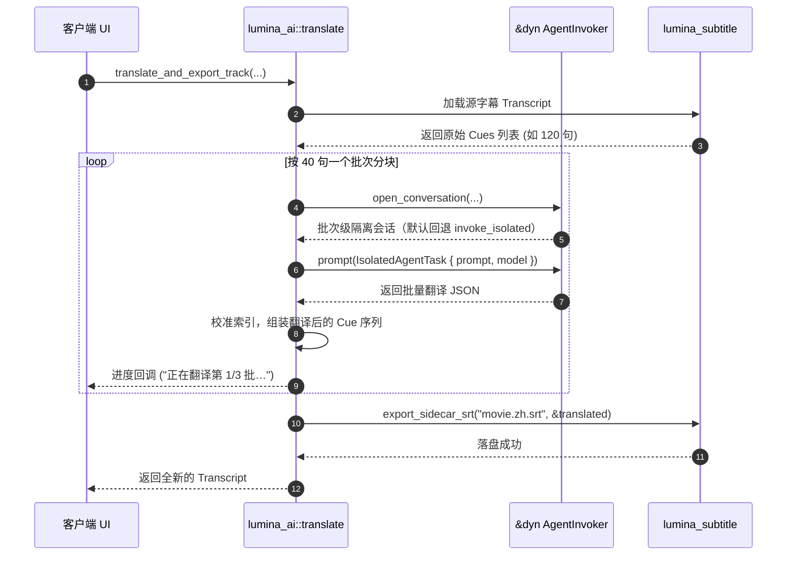

# lumina-ai

`lumina-ai` 是 Lumina 的短周期、数据隔离式 AI 任务领域库。它专门处理无需长会话上下文的无状态批量 AI 任务（当前核心为**智能字幕翻译与润色**），通过依赖倒置端口 `AgentInvoker` 完成模型交互，确保不污染用户的正常聊天（Chat）历史记录。

---

## 1. 模块定位与职责

在 Lumina 架构中，`lumina-ai` 与 `lumina-acp` 形成清晰的职责区隔：

```text
[用户发起字幕翻译] ──────────────┐
                                 ▼
                         [ lumina-ai ]
                                 │
                         (使用 AgentInvoker 端口)
                                 ▼
                 [apps/desktop 适配注入的 ACP 调用]
                                 │ (作业级隔离 session pool)
                                 ▼
                          [ 大语言模型 ]
                                 │
                                 ▼
                        [ lumina-subtitle ]
                     (导出为新语言外挂字幕)
```

- **职责对比**：
  - `lumina-acp`：负责**长生命周期、有交互历史、带工具权限**的 Chat 侧边栏对话。
  - `lumina-ai`：负责**数据级隔离、批处理吞吐**的专项任务。每个字幕作业独立于 Chat 历史；宿主可以用作业级 session pool 复用隔离 Agent，作业结束后统一销毁，绝不向 Chat 注入几十页的字幕原文。
- **核心功能**：
  - 分块批处理（Chunked Batching）：将成百上千条字幕拆分为 40 条左右的批次（`TRANSLATE_BATCH_SIZE = 40`），避免单次 Prompt 击穿上下文或产生幻觉。
  - 严格结构化约束：利用 JSON Schema 约束模型按序输出带序号的翻译文本，确保时间戳轴精准对齐。
  - 自动落盘与回显：翻译完成后自动通过 `lumina-subtitle` 写入对应语言后缀的 `.srt` 外挂文件。

---

## 2. 构建思路与设计原则

1. **聊天会话零污染（Zero Chat History Pollution）**：
   - 如果直接在主聊天窗口让 Agent 翻译一部电影的 1500 句台词，会导致后续对话的 Token 消耗激增、上下文被噪音淹没。`lumina-ai` 为每个批次通过 `AgentInvoker::open_conversation` 获取隔离会话；默认实现会回退到 `invoke_isolated`，宿主也可以通过 `WorkshopPool` 复用作业级隔离 session，但不会复用 Chat session。
2. **纯依赖注入与面向端口编程（Port-Driven）**：
   - 本 crate 仅依赖 `lumina-core` 和 `lumina-subtitle`，完全不直接依赖 `lumina-acp`、子进程或网络库。具体的 AI 模型调用由宿主通过动态分发 `&dyn AgentInvoker` 传入。

---

## 3. 对外使用指南

### 在 Cargo workspace 中添加依赖

```toml
[dependencies]
lumina-ai.workspace = true
```

### 代码使用示例

```rust
use lumina_ai::{translate_and_export_track, AgentInvoker, IsolatedAgentTask, AgentTaskError};

// 1. 宿主提供实现了 AgentInvoker 的调用器
struct MyInvoker;
impl AgentInvoker for MyInvoker {
    fn invoke_isolated(&self, task: IsolatedAgentTask) -> Result<String, AgentTaskError> {
        // 调用底层的 ACP 适配层或直接请求 LLM
        Ok(r#"{"cues":[{"index":1,"text":"你好世界"}]}"#.into())
    }
}

let invoker = MyInvoker;

// 2. 发起字幕翻译流水线
let result = translate_and_export_track(
    "D:/Movies/interstellar.mkv",
    "embedded:0", // 源字幕轨 ID
    "zh-Hans",    // 目标语言
    None,         // 翻译上下文（简介＋人名表，可空）
    "default",    // Profile ID
    Some("gpt-4o"),
    None,
    &invoker,
    |update| {
        println!("当前进度: {}", update.message);
    },
    None, // 检查点工厂（断点续翻），不需要传 None
    "demo-job", // 作业 ID（日志关联用，不进模型）
);
```

---

## 4. 内部子模块全景

`lumina-ai/src/` 包含以下核心源码模块。翻译功能现在采用目录模块布局：`translate/mod.rs` 是 `translate` 的模块入口，原来的 `translate.rs` 已移除；因此 `lumina_ai::translate::*` 与 crate 根部重新导出的公开 API 均保持不变。

| 源码文件 | 模块名称 | 核心职责与导出项 |
| :--- | :--- | :--- |
| [`lib.rs`](./lib.rs) | 根模块 | 重新导出公开接口；定义隔离调用原则。 |
| [`translate/mod.rs`](./translate/mod.rs) | `translate` 入口 | 保存公开契约：语言归一化、批次大小、进度类型、检查点工厂、翻译结果类型，以及各子模块的公开 re-export。 |
| [`translate/orchestrator.rs`](./translate/orchestrator.rs) | 编排层 | • `translate_and_export_track`: 加载源字幕、调用翻译流程并导出 `.srt`。<br>• `translate_cues`: 纯内存字幕队列翻译，最多 4 个隔离 Agent 并发、按输入顺序合并，并执行索引/人名校验与单次重试。<br>• `proofread_cues`: 同语言校对，不翻译、不改变时间轴。 |
| [`translate/agent.rs`](./translate/agent.rs) | Agent 交互层 | 构造翻译/校对任务 Prompt，调用 `AgentInvoker`，解析结构化 JSON，并映射底层 Agent 错误。 |
| [`translate/batch.rs`](./translate/batch.rs) | 批处理基础设施 | 批次并发执行、结果按序合并、索引对齐、一次性修复重试和人名词表校验。 |
| [`translate/context.rs`](./translate/context.rs) | 上下文与词表 | 管理剧集简介、人名变体、翻译词表及跨批次新增的人名上下文。 |
| [`translate/tests.rs`](./translate/tests.rs) | 单元测试 | 覆盖批次顺序、断点恢复、JSON 修复、错误映射、词表重试和时间轴保持。 |

---

## 5. 核心协作与数据流向



## 6. 版本化提示词仓库

`lumina_ai::prompts` 是章节 Agent 和富内容任务的唯一专有 prompt 归属。它提供六个类型化
任务 ID：`chapter_segment`、`chapter_recap`、`chapter_outlook`、`plot_summary`、
`question_candidates` 和 `rewrite_content`。调用方通过 `PromptSlots` 传入媒体、章节、字幕
窗口、截图引用、观看位置、源内容和用户指令等结构化动态上下文；React 不需要保存或拼接
专有 prompt。

初始 prompt 由 `PromptRepository::compose` 或 `PromptComposer::compose` 创建。校验失败时，
调用 `ComposedPrompt::append_validation_report`，只取得当前 `ValidationReport` 对应的
`ValidationDelta::message` 追加到仍存活的会话。每个 prompt 最多允许三次验证重试；超过上限
会返回 `ValidationRetryError::RetryLimitExceeded`，不会重新发送初始 prompt 或完整上下文。
