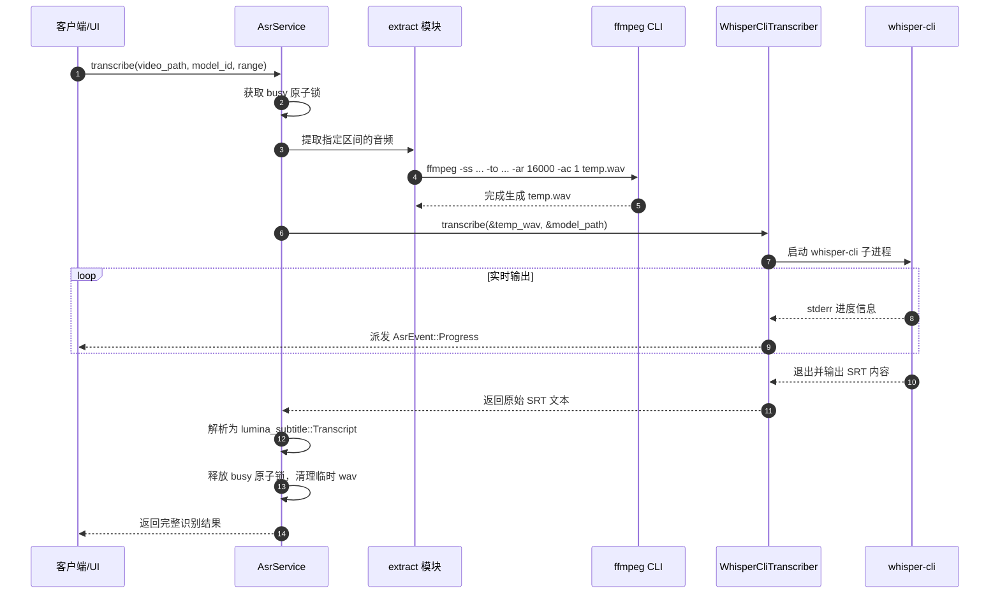

# lumina-asr

`lumina-asr` 是 Lumina 的可选本地离线自动语音识别（Automatic Speech Recognition）领域库。它基于 `whisper.cpp` 引擎生态构建，提供完全在用户本地运行的模型下载管理、音频提取切片、转写调度及结构化字幕生成功能。

---

## 1. 模块定位与职责

在 Lumina 产品体系中，ASR 是纯粹的**按需（On-Demand）增强特性**：

```text
[lumina-media] (探测音频流)
      │
      ▼
 [lumina-asr] ──(提取16kHz音频)──► ffmpeg (native)
      │
      ├──(运行识别)──► whisper-cli (native / ggml-*.bin)
      │
      ▼
[lumina-subtitle] (将识别结果输出为标准 Transcript / Cue 结构)
```

- **职责**：
  - 维持完全按需加载：程序启动或常规播放时**绝对不预载任何模型到内存**。
  - 模型与运行时安装管理：提供官方目录（Tiny / Base / Small 等 ggml 模型）下载、进度上报及二进制可执行文件校验。
  - 预处理流水线：利用 `ffmpeg` 将视频中的音轨抽取并重采样为 whisper 所需的标准格式（16kHz、16-bit、Mono WAV）。
  - 区间分片识别：支持全片转写或针对特定时间跨度（`AsrRange`，如单章节或特定起止时间）转写。
  - 输出与保存：自动生成 `.asr.srt` 外挂字幕文件或直接集成到播放器的字幕轨选择列表。
- **硬约束**：
  - 未配置或未下载模型时，API 必须明确返回 `NotConfigured`，不得阻断播放器与应用的正常运行。
  - 终端用户无需自行配置 Python、CUDA 或环境变量；所有模型与二进制文件隔离在应用专属数据目录。

---

## 2. 构建思路与设计原则

1. **零内存常驻（Zero Startup Footprint）**：
   - 语音识别模型体量较大（从 75MB 到数 GB 不等）。`lumina-asr` 将模型加载与进程生命周期完全绑定在单次任务调用中，任务结束即释放，不占用桌面日常播放的宝贵内存。
2. **抽象转写引擎接口（Transcriber Port）**：
   - 定义了 `Transcriber` 特征（Trait），默认实现为基于外部子进程的 `WhisperCliTranscriber`。这种设计使得在单测时可以轻松 Mock，且未来可以平滑替换为 C-FFI 绑定或其它轻量端侧引擎。
3. **单并发互斥保护（Busy Guarding）**：
   - 识别任务极其消耗 CPU/GPU 算力，`AsrService` 内部使用原子标志（`AtomicBool`）严格限制同一时刻仅允许一个转写任务运行，防止多任务并发导致系统卡死。

---

## 3. 对外使用指南

### 添加依赖

```toml
[dependencies]
lumina-asr = { path = "../lumina-asr" }
```

### 代码使用示例

#### 1. 检查 ASR 环境状态与已安装模型

```rust
use lumina_asr::AsrService;

let asr = AsrService::new();
let status = asr.status();

println!("Whisper CLI 是否可用: {}", status.cli_available);
println!("当前已安装模型数量: {}", status.installed_models.len());
```

#### 2. 发起转写并监听进度

```rust
use std::path::Path;
use lumina_asr::{AsrService, AsrRange};

let asr = AsrService::new();
let video_path = Path::new("D:/Podcasts/episode.mp4");

// 执行转写，可选指定起止区间或章节
let transcript = asr.transcribe(
    video_path,
    "base", // model_id
    AsrRange::All,
    |event| {
        println!("转写进度: {:?}", event);
    },
)?;

println!("成功生成字幕，共 {} 句", transcript.cues.len());
```

---

## 4. 内部子模块全景

`lumina-asr/src/` 包含以下 8 个源码模块：

| 源码文件 | 模块名称 | 核心职责与导出项 |
| :--- | :--- | :--- |
| [`lib.rs`](file:///d:/project/rust/tauri/lumina/crates/lumina-asr/src/lib.rs) | 根模块 | 重新导出公开接口；定义按需调用边界约束。 |
| [`service.rs`](file:///d:/project/rust/tauri/lumina/crates/lumina-asr/src/service.rs) | `service` | • `AsrService`: 对外核心服务门面，管理并发锁与流水线调度。 |
| [`transcriber.rs`](file:///d:/project/rust/tauri/lumina/crates/lumina-asr/src/transcriber.rs) | `transcriber` | • `Transcriber`: 转写引擎抽象 Trait。<br>• `WhisperCliTranscriber`: 默认实现的 whisper-cli 驱动。 |
| [`whisper_cli.rs`](file:///d:/project/rust/tauri/lumina/crates/lumina-asr/src/whisper_cli.rs) | `whisper_cli` | 拼接 CLI 参数、启动 whisper 子进程、实时捕获进度并解析其输出的 SRT。 |
| [`extract.rs`](file:///d:/project/rust/tauri/lumina/crates/lumina-asr/src/extract.rs) | `extract` | 调用 ffmpeg 将音轨精确抽离切片为临时 `16kHz Mono 16-bit PCM WAV` 文件。 |
| [`download.rs`](file:///d:/project/rust/tauri/lumina/crates/lumina-asr/src/download.rs) | `download` | • 官方模型目录元数据（Tiny, Base, Small, Medium 等）。<br>• 基于 HTTP 的模型流式下载、断点续传与 SHA-256 完整性校验。 |
| [`paths.rs`](file:///d:/project/rust/tauri/lumina/crates/lumina-asr/src/paths.rs) | `paths` | 解析本机 whisper 运行时、各型号 bin 权重文件存放目录及临时工作区。 |
| [`model.rs`](file:///d:/project/rust/tauri/lumina/crates/lumina-asr/src/model.rs) | `model` | • `AsrStatus`, `AsrModelInfo`, `AsrCatalogModel`。<br>• `AsrEvent`（转写进度）与 `AsrInstallEvent`（下载安装进度）。<br>• `AsrRange`: `All` / `Chapter(usize)` / `Window { from_ms, to_ms }`。 |
| [`error.rs`](file:///d:/project/rust/tauri/lumina/crates/lumina-asr/src/error.rs) | `error` | • `AsrError` 与 `AsrErrorCode`（`NotConfigured`, `Busy`, `ModelNotFound`, `ExtractFailed`, `TranscribeFailed`）。 |

---

## 5. 核心协作与数据流向


