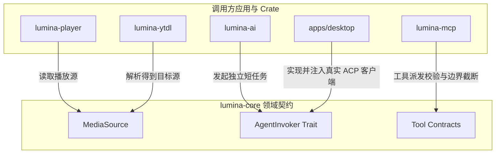

# lumina-core

`lumina-core` 是 Lumina 项目最底层的领域共享抽象核心库。它定义了跨多个 crate 共享的稳定值对象（Value Objects）与端口特征（Traits/Ports），并且**完全不依赖任何其他 lumina 业务 crate**。

---

## 1. 模块定位与职责

在 Lumina 的分层架构中，`lumina-core` 处于依赖关系的最底端（Foundation Layer）：

```text
[lumina-player] [lumina-ytdl] [lumina-ai] [lumina-mcp] [lumina-library]
        \            |            |           |           /
         \           |            |           |          /
          ▼          ▼            ▼           ▼         ▼
                       [ lumina-core ]
```

- **职责**：
  - 提供无具体实现依赖的媒体源模型（`MediaSource`），解开 `player` 与 `ytdl` 之间的双向循环依赖。
  - 提供数据隔离的 AI 任务调用契约（`AgentInvoker`），使 `lumina-ai` 等业务任务不与具体的 ACP 客户端或模型调用引擎强绑定。
  - 提供协议无关的 Agent 工具契约（`tool_contract`），将 10 个核心工具的参数边界、工具命名与结果验证固定下来，剥离任何 MCP/JSON-RPC 传输层依赖。
- **硬约束**：
  - 零内部业务 crate 依赖，仅依赖 Rust `std` 与基础序列化库 `serde`。
  - 禁止引入 Tauri、libmpv、SQLite/文件 IO、ACP 子进程或网络客户端。
  - 保持机器边界和用户呈现文案的绝对稳定性。

---

## 2. 构建思路与设计原则

1. **依赖倒置与解环（Dependency Inversion & Decoupling）**：
   - 过去在线播放功能中，`player` 需要感知 URL 解析与 `ytdl`，而 `ytdl` 需要引用播放目标结构，极易形成循环依赖。`lumina-core` 通过抽取统一的 `MediaSource` 枚举（`Local` 与 `Remote`），使底层播放器只面向 `MediaSource` 编程。
2. **端口与适配器模式（Ports and Adapters / Hexagonal Architecture）**：
   - `AgentInvoker` 是典型的输出端口（Port）。上层的短任务（例如字幕润色、翻译）只需依赖该 trait 提交 `IsolatedAgentTask`；下层的真实 Agent 进程派生与 ACP 连接则由 app 或适配层在运行时装配注入。
3. **脱敏与传输无关（Transport-Free Tool Contract）**：
   - `tool_contract` 定义了 10 个标准工具的名称、参数边界限制（如行数、窗口跨度上限）以及无歧义的错误类型。这保证了任何工具调用方（无论是本地测试、内部调用还是通过 MCP JSON-RPC）表现出完全一致的鲁棒性，且杜绝敏感数据（如 Cookie、临时签名 URL、stderr）渗入。

---

## 3. 对外使用指南

### 添加依赖

在其他 crate 的 `Cargo.toml` 中引用：

```toml
[dependencies]
lumina-core = { path = "../lumina-core" }
```

### 代码使用示例

#### 1. 使用 `MediaSource` 规范播放源

```rust
use lumina_core::{MediaSource, MediaSourceKind};

let source = MediaSource::parse("https://www.youtube.com/watch?v=dQw4w9WgXcQ")
    .expect("valid remote url");

match source {
    MediaSource::Local { ref path } => println!("本地文件播放: {path}"),
    MediaSource::Remote { ref url } => println!("在线流媒体播放: {url}"),
}

// 提取稳定的媒体标识符（用于关联字幕或历史记录）
assert_eq!(source.kind(), MediaSourceKind::Remote);
let id = source.stable_id();
```

#### 2. 实现或调用 `AgentInvoker` 端口

```rust
use lumina_core::{AgentInvoker, AgentTaskError, IsolatedAgentTask};

struct MockInvoker;

impl AgentInvoker for MockInvoker {
    fn invoke_isolated(&self, task: IsolatedAgentTask) -> Result<String, AgentTaskError> {
        println!("执行隔离任务，Prompt: {}", task.prompt);
        Ok("mocked translation result".to_string())
    }
}
```

---

## 4. 内部子模块全景

`lumina-core/src/` 的主要实现模块如下；列表聚焦稳定的核心文件，内部辅助文件可随实现调整：

| 源码文件 | 模块名称 | 核心职责与导出项 |
| :--- | :--- | :--- |
| [`lib.rs`](./lib.rs) | 根模块 | 重新导出公开接口；定义宏观架构约束。 |
| [`media_source.rs`](./media_source.rs) | `media_source` | • `MediaSource`: 本地路径与远程 URL 统一枚举。<br>• `MediaSourceKind`: 精简的类型分类指示器。<br>• `MediaSourceError`: 标准错误对象，内含固定中文报错信息。<br>• 路径规范化、文件后缀探测与 `stable_id` 算法。 |
| [`agent_invoker.rs`](./agent_invoker.rs) | `agent_invoker` | • `AgentInvoker`: 无状态 AI 执行端口（Trait）。<br>• `IsolatedAgentTask`: 独立任务请求（Prompt、Model、Reasoning Effort）。<br>• `AgentTaskError`: 区分未配置、执行失败和无有效输出（`NotConfigured` / `Failed` / `NoOutput`）。 |
| [`tool_contract.rs`](./tool_contract.rs) | `tool_contract` | • 10 个系统 Agent 工具名称常量（如 `lumina_get_playback_context`）。<br>• `ALL_TOOLS`、`TOOL_COUNT` 与 `is_known_tool()` 白名单校验。<br>• 各工具参数输入验证、边界 Clamp 及结构化错误类型。 |

---

## 5. 核心协作与数据流向



通过这一套契约设计，上层 crate 在互不直接依赖的情况下，能够保证跨进程通信、流媒体解算与 AI 调用的完全互通。
