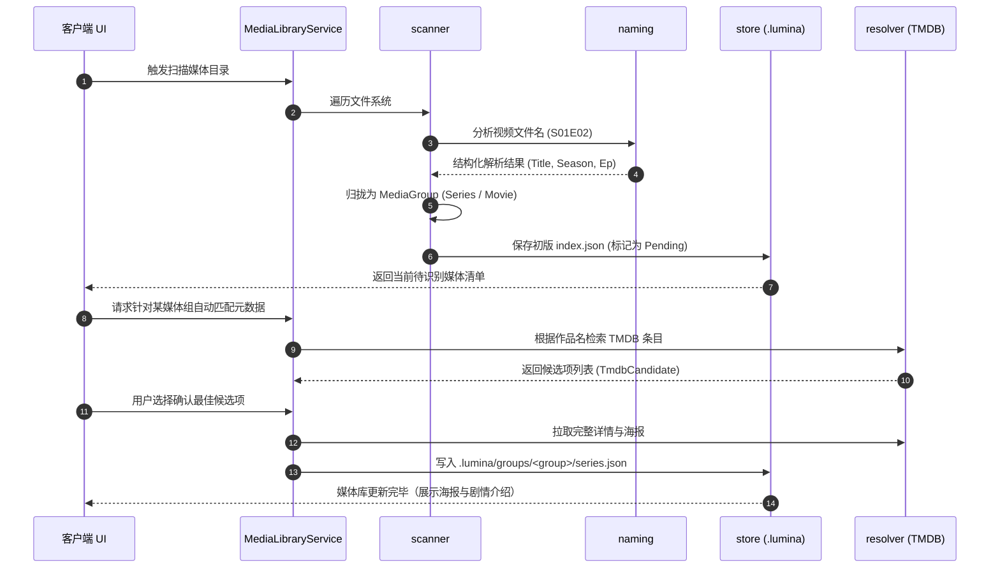

# lumina-library

`lumina-library` 是 Lumina 的本地影视媒体库与元数据解析聚合领域库。它提供本地多媒体文件夹扫描、复杂的剧集/电影命名启发式识别、TMDB 在线影视元数据匹配、维基百科深度背景条目抽取，以及基于 `.lumina/` 的无侵入式元数据持久化管理。

---

## 1. 模块定位与职责

在 Lumina 架构中，`lumina-library` 为 AI Agent 和用户界面提供宏观的“影视世界观与背景知识（Worldview & Lore Context）”：

```text
[本地影视目录] (如 D:/Movies, E:/Anime/Frieren)
        │
        ▼ (扫描与启发式命名解析)
[lumina-library] ──(TMDB / Wikipedia 抓取与富化)
        │
        ├───────────────────────┬────────────────────────┐
        ▼                       ▼                        ▼
本地 .lumina 索引仓库        前端媒体库视图          [lumina-mcp]
(index.json / series.json)  (海报墙 / 剧集选集)   (向 Agent 注入世界观与人物志)
```

- **职责**：
  - 本地目录扫描（`scanner`）：递归扫描用户配置的媒体根目录，滤除非媒体杂项，构建媒体文件索引。
  - 启发式命名解析（`naming`）：通过正则与启发式算法，自动从混沌的文件名中精准提取作品名称、年份（`2024`）、季度（`S01`）、集数（`E05`）及版本特征（`1080p` / `Director's Cut`）。
  - 媒体分组与层级建模：将单文件聚合为“电影（Movie）”或“剧集（Series/Season）”组（`MediaGroup`）。
  - 在线元数据富化（`resolver` & `wikipedia`）：直接查询 TMDB API 获取标准海报、剧集简介、演员表；或查询 Wikipedia 条目抽取角色设定表（Characters）与背景故事。
  - 安全凭证管理（`credentials`）：集成操作系统安全存储（Windows Credential Manager / macOS Keychain）保管 TMDB API Token。
- **硬约束**：
  - 无侵入存储：所有索引与抓取的元数据集中存放在媒体根目录的 `.lumina/` 隐藏文件夹中，**绝不修改或重命名用户的原始视频文件**。
  - 离线降级可用：网络不通或未配置 TMDB 时，本地文件扫描与纯文件播放依然 100% 可用。

---

## 2. 构建思路与设计原则

1. **分段式元数据管线（Staged Metadata Pipeline）**：
   - 目录扫描不阻塞在线匹配：第一阶段纯本地零网络 IO 快速生成待匹配组（`Pending`）；第二阶段用户或后台按需触发异步 TMDB 候选匹配（`Resolved`）；第三阶段可选 Wikipedia 深度富化（`WikiEnrichment`）。
2. **轻量与幂等持久化（Store & Change Detection）**：
   - `store.rs` 实现了 `save_if_changed` 机制。只有在媒体库文件内容或匹配状态真正发生变动时，才采用原子替换写盘；首次访问未初始化目录时优雅返回 `Ok(None)`，杜绝无意义的 IO 抖动。
3. **Agent 上下文赋能（Context Builder for AI）**：
   - 本模块输出的 `MediaMetadataContext` 不仅服务于 UI 展示，更是 MCP Agent 解答剧集剧情、人物关系时的核心知识库来源。

---

## 3. 对外使用指南

### 添加依赖

```toml
[dependencies]
lumina-library = { path = "../lumina-library" }
```

### 代码使用示例

#### 1. 扫描媒体库根目录

```rust
use lumina_library::{MediaLibraryService, LibraryWatchConfig};

let library = MediaLibraryService::new();
let config = LibraryWatchConfig {
    roots: vec!["D:/Anime".into(), "D:/Movies".into()],
    interval_secs: 300,
};

// 启动并执行初始扫描
let status = library.start_with_progress(config, |event| {
    println!("扫描进度: {:?}", event);
})?;

println!("已索引文件总数: {}", status.indexed_files);
println!("待匹配媒体组数: {}", status.pending_groups);
```

#### 2. 解析文件名为剧集信息

```rust
use lumina_library::naming;

let filename = "[Sub] Frieren Beyond Journey's End - S01E08 [1080p].mkv";
let parsed = naming::parse_media_title(filename);

println!("识别作品名: {:?}", parsed.title); // Frieren Beyond Journey's End
println!("季度: {:?}, 集数: {:?}", parsed.season, parsed.episode); // Some(1), Some(8)
```

---

## 4. 内部子模块全景

`lumina-library/src/` 的主要实现模块如下；列表聚焦稳定的核心文件，内部辅助文件可随实现调整：

| 源码文件 | 模块名称 | 核心职责与导出项 |
| :--- | :--- | :--- |
| [`lib.rs`](./lib.rs) | 根模块 | 重新导出公开接口；定义领域抽象。 |
| [`service.rs`](./service.rs) | `service` | • `MediaLibraryService`: 核心门面，管理定时扫描工作线程、运行时状态与异步取消。 |
| [`scanner.rs`](./scanner.rs) | `scanner` | 遍历文件夹目录树，过滤隐藏文件/非媒体文件，将扫描到的音视频聚合为 `MediaGroup`。 |
| [`naming.rs`](./naming.rs) | `naming` | 强大的文件名解析引擎，精准识别 SxxExx、清晰度、压制组、分卷信息与标准标题。 |
| [`store.rs`](./store.rs) | `store` | 管理 `.lumina/index.json` 及分集数据文件；提供变更比对、原子替换与容错加载。 |
| [`resolver.rs`](./resolver.rs) | `resolver` | • `RemoteResolver`: TMDB 客户端，负责根据标题搜索条目并拉取季度/单集全量元数据。 |
| [`wikipedia.rs`](./wikipedia.rs) | `wikipedia` | 请求 MediaWiki API 获取条目正文与分集信息，作为 TMDB 的深度背景补充。 |
| [`wikitext/mod.rs`](./wikitext/mod.rs) | `wikitext` | 维基语法专用清洗解析器，提取出纯净的人员登场列表与世界观梗概。 |
| [`metadata.rs`](./metadata.rs) | `metadata` | 聚合底层各来源元数据，构造统一的 `MediaMetadataContext` 与 `MergedMediaContext`。 |
| [`paths.rs`](./paths.rs) | `paths` | 路径计算工具，处理根目录与媒体文件相对路径转换，定位各级 `.lumina` 存放路径。 |
| [`credentials.rs`](./credentials.rs) | `credentials` | 操作系统安全 Keyring 桥接，负责 TMDB API Key 的安全存取与连通性验证。 |
| [`model.rs`](./model.rs) | `model` | • 完整的领域 DTO 集合：`LibraryIndex`, `MediaGroup`, `StoredMetadata`, `TmdbCandidate` 等。 |
| [`error.rs`](./error.rs) | `error` | • `LibraryError` 与 `LibraryErrorCode`（`StorageFailed`, `ScanFailed`, `ResolutionFailed` 等）。 |

---

## 5. 核心协作与数据流向


