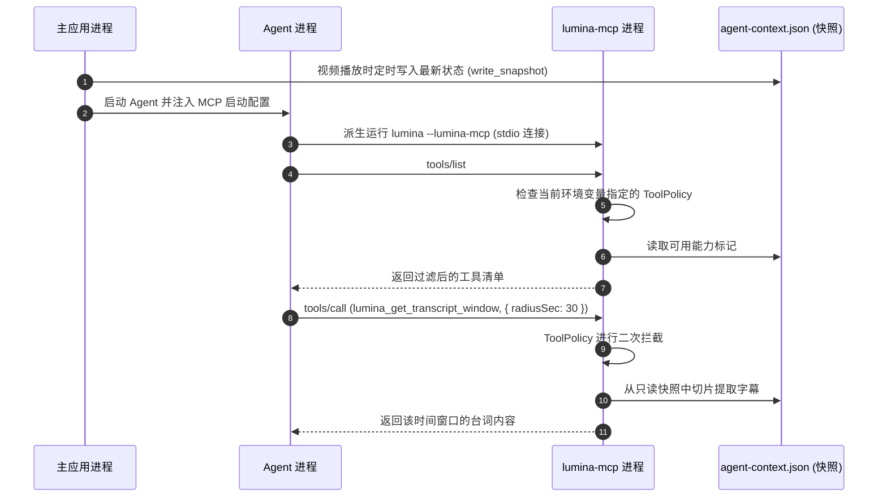

# lumina-mcp

`lumina-mcp` 是 Lumina 的 Model Context Protocol（MCP）服务器端领域实现库。它将 Lumina 的播放状态、字幕文稿、媒体库元数据、视频帧捕获和批注建议封装为标准的 MCP 规范工具集，通过 stdio 子命令暴露给外部 Agent，并内置了精细的基于场景的工具策略控制（Tool Policy）。

---

## 1. 模块定位与职责

在 Lumina 架构中，`lumina-mcp` 是连接智能体与播放器上下文的**能力提供者（Tool Provider）**：

```text
[外部 Agent 进程] (如 Codex / Claude Code)
        │
        │ (通过 stdio 遵循 MCP 规范)
        ▼
   [lumina-mcp] (以 --lumina-mcp 子命令形式作为独立进程运行)
        │
        ├─► [policy] (二次拦截校验，按 Profile 限制工具可见性)
        ├─► [snapshot] (读取 .lumina/agent-context.json 只读快照)
        │
        ├───────────────────────┬────────────────────────┐
        ▼                       ▼                        ▼
 [lumina-player/media]    [lumina-subtitle]        [lumina-library]
 (播放快照、截图抓取)      (分窗返回文稿台词)        (剧集世界观背景查询)
```

- **职责**：
  - MCP stdio 服务端运行（`server`）：响应 `initialize`、`tools/list` 与 `tools/call` 标准 JSON-RPC 2.0 请求；只读工具经有界 worker 并行执行，写入工具保持独占。
  - 单一无锁只读快照机制（`snapshot`）：通过 `.lumina/agent-context.json` 快照解耦主进程与 MCP 子进程，避免跨进程死锁与状态竞态。
  - 提供 10 个标准的 Agent 工具（对应 `lumina-core::tool_contract` 中的规范）：
    1. `lumina_get_playback_context`：查询快照锚点（进度/时长）与本集剧情 `currentEpisode`。
    2. `lumina_get_library_context`：查询当前媒体所属剧集/电影的元数据信息。
    3. `lumina_get_episode_index`：查询当前剧集所在季度的所有分集列表。
    4. `lumina_get_transcript_window`：按时间窗口滑动拉取当前播放点附近的字幕台词。
    5. `lumina_get_episode_transcript`：读取指定单集的完整台词文稿。
    6. `lumina_get_audio_marks`：获取当前视频的音频能量与静音区间。
    7. `lumina_get_subtitle_cues`：结构化获取字幕行（支持按区间范围过滤）。
    8. `lumina_write_subtitle_track`：允许 Agent 写入或导出校对后的字幕轨。
    9. `lumina_capture_frames`：按时间戳请求截取一帧或多帧视频画面。
    10. `lumina_propose_video_annotation`：向用户提出视频笔记标注建议。
  - 双重拦截与最小权限策略（`policy`）：确保 `tools/call` 无法绕过 `tools/list` 声明的范围；支持按任务场景（如仅字幕工作台、仅剧集元信息查询）分发不同的工具策略。
- **硬约束**：
  - 脱敏原则：快照与工具输出中绝对不包含 Cookie、临时签名 URL、本地绝对敏感路径或子进程 stderr。
  - 与主应用同二进制可执行文件：通过主程序追加 `--lumina-mcp` 参数直接作为轻量 MCP 服务器启动。

---

## 2. 构建思路与设计原则

1. **同进程二进制派生（In-Process Subcommand Spawn）**：
   - 不需要单独分发一个庞大的独立 Node.js/Python 服务。主程序在启动时检测 `std::env::args()` 是否包含 `--lumina-mcp`，若存在则直接进入 `run_stdio_server()`，资源消耗极低。
2. **基于快照的无状态交互（Snapshot-Based Isolation）**：
   - MCP 工具调用频繁。如果每个工具都去跨进程 IPC 实时锁死正在运行的 `libmpv` 播放器，极易引起 UI 掉帧卡顿。主程序在关键事件（切换视频、暂停、跳转）时异步写入脱敏的 `LuminaMcpSnapshot` 快照，MCP 工具只读取该快照，保证瞬时响应。
3. **策略双重守护（Dual-Defense Policy）**：
   - 外部 Agent 即使尝试盲调未开放的工具名称，`policy::ToolPolicy` 也会在分发执行前强制阻断，确保数据安全。

---

## 3. 对外使用指南

### 在 Cargo workspace 中添加依赖

```toml
[dependencies]
lumina-mcp.workspace = true
```

### 代码使用示例

#### 1. 主程序入口处挂接 MCP 子命令检测

在桌面应用的主入口（如 `main.rs`）最顶部：

```rust
fn main() {
    // 如果命令行带 --lumina-mcp 参数，直接作为 MCP 服务器运行并退出
    if lumina_mcp::run_if_invoked() {
        return;
    }

    // 正常启动桌面 UI ...
}
```

#### 2. 配置 Agent 启动时的 MCP 服务器项

```rust
use std::path::Path;
use lumina_mcp::lumina_mcp_servers;

let snapshot_path = Path::new("D:/Movies/.lumina/agent-context.json");
// 自动生成符合 ACP / Claude 格式的 mcpServers JSON 配置
let mcp_config = lumina_mcp_servers(snapshot_path);
```

---

## 4. 内部子模块全景

`lumina-mcp/src/` 的主要实现模块如下；列表聚焦稳定的核心文件，内部辅助文件可随实现调整：

| 源码文件 | 模块名称 | 核心职责与导出项 |
| :--- | :--- | :--- |
| [`lib.rs`](./lib.rs) | 根模块 | • `run_if_invoked`: 进程入口劫持。<br>• `lumina_mcp_server_entry`: 构造 Agent 所需的 MCP 启动命令。 |
| [`server.rs`](./server.rs) | `server` | 遵循 MCP 规范的标准输入输出循环泵（Stdio Event Loop），处理请求路由与 JSON 响应封装。 |
| [`executor.rs`](./executor.rs) | `executor` | 固定 worker 数量的有界任务执行器；让独立工具并行运行，避免无限创建线程。 |
| [`policy.rs`](./policy.rs) | `policy` | • `McpToolProfile`: `All` / `Chat` / `SubtitleWorkshop` / `MetadataResolver` / `NoTools`。<br>• `ToolPolicy`: 工具可见性与调用权限双重校验器。 |
| [`tools.rs`](./tools.rs) | `tools` | 10 个标准工具的具体分发执行函数（`handle_tool_call`），与下游各 crate 联动处理业务。 |
| [`snapshot.rs`](./snapshot.rs) | `snapshot` | • `LuminaMcpSnapshot`: 脱敏只读快照数据结构。<br>• 快照文件读写、版本控制（`SNAPSHOT_SCHEMA_VERSION`）与安全路径探测。 |
| [`build.rs`](./build.rs) | `build` | 汇总媒体、文稿、媒体库信息，组装构建 `LuminaMcpSnapshot` 的辅助构造器。 |

---

## 5. 核心协作与数据流向


