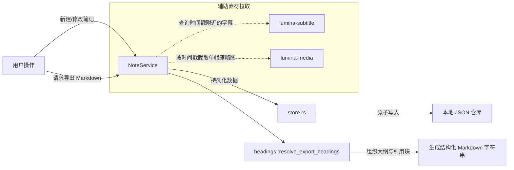

# lumina-notes

`lumina-notes` 是 Lumina 的视频笔记与知识导出领域库。它提供基于时间戳锚点（Timestamp Anchor）的笔记记录、原文字幕金句引用（Quotes）、视频截图帧附件绑定、多级大纲对齐以及富文本 Markdown 导出能力，**完全无需依赖任何 AI 服务即可独立工作**。

---

## 1. 模块定位与职责

在 Lumina 架构中，`lumina-notes` 实现了将“视频观看”转化为“持久化个人知识”的核心闭环：

```text
[lumina-media] (截取时间戳画面帧)
      │
      ▼
[lumina-notes] ◄─── [lumina-subtitle] (提取对应时间戳的原文字幕引用)
      │
      ├───────────────────────────────┐
      ▼                               ▼
 本地 JSON 存储 (.lumina/notes)    Markdown 格式化导出
                                      │
                                      ▼
                        Obsidian / Logseq / Notion 等
```

- **职责**：
  - 核心 CRUD：按媒体唯一标识（本地路径或远程 URL）创建、查询、修改和删除带有毫秒级时间戳（`position_ms`）的笔记。
  - 自动字幕引证（`quotes`）：记录笔记时，自动从当前正在激活的字幕轨道中匹配该时间戳附近的原片台词作为引用块。
  - 关键画面截帧绑定（`frame`）：关联调用 `lumina-media::frame_capture` 保存当前画面的高清帧附件。
  - 结构化 Markdown 导出：自动结合视频章节、剧集元数据、时间戳链接、台词引用与画面截图，生成排版优美的 Markdown 笔记。
  - AI 提议承接（`proposal`）：承接来自 Agent 工具（`lumina_propose_video_annotation`）生成的结构化注释建议。
- **硬约束**：
  - 本地优先：基础笔记与导出功能纯本地离线运行，绝对不依赖网络或 AI。
  - 原子持久化：笔记保存采用安全落盘写入机制，杜绝断电或崩溃导致数据丢失。

---

## 2. 构建思路与设计原则

1. **锚点驱动（Anchor-Driven Design）**：
   - 视频笔记与普通笔记最大的不同在于“时空对齐”。每条笔记都有不可或缺的时间戳（`position_ms`），在导出的 Markdown 中会自动转化为方便点击跳转的格式（如 `[01:23:45]`），同时可携带原片截图和字幕引用。
2. **大纲结构自适应对齐（Outline & Heading Alignment）**：
   - 在导出笔记时，`headings` 模块会分析视频的容器章节（Chapters）或元数据，将分布在不同时间轴上的笔记自动归纳到对应章节的二级/三级标题下，形成层次分明的大纲文档。
3. **松耦合与安全隔离**：
   - 依赖 `lumina-media` 和 `lumina-subtitle` 获取辅助素材，但笔记本身的数据结构保持独立自洽；如果视频文件移动或字幕丢失，已有笔记文本绝不损坏。

---

## 3. 对外使用指南

### 添加依赖

```toml
[dependencies]
lumina-notes = { path = "../lumina-notes" }
```

### 代码使用示例

#### 1. 创建一条带有字幕引用和时间戳的笔记

```rust
use lumina_notes::{NoteService, NoteCreate, NoteQuote};

let service = NoteService::new();

let note = service.create(NoteCreate {
    media_path: "D:/Courses/Rust_Advanced.mp4".into(),
    position_ms: 125_400, // 02:05.400
    body: "这里讲解了生命周期的子类型化（Subtyping）".into(),
    quote: Some(NoteQuote {
        text: "Lifetime subtyping is a form of variance in Rust.".into(),
        start_ms: 124_000,
        end_ms: 128_000,
    }),
    frame: None,
})?;

println!("已创建笔记 ID: {}", note.id);
```

#### 2. 导出视频的完整 Markdown 笔记

```rust
let media = "D:/Courses/Rust_Advanced.mp4";
let markdown = service.export_markdown(media, None)?;

println!("导出的 Markdown 内容:\n{}", markdown);
// 可直接写入 .md 文件供 Obsidian 或其他知识库阅读
```

---

## 4. 内部子模块全景

`lumina-notes/src/` 包含以下 7 个源码模块：

| 源码文件 | 模块名称 | 核心职责与导出项 |
| :--- | :--- | :--- |
| [`lib.rs`](file:///d:/project/rust/tauri/lumina/crates/lumina-notes/src/lib.rs) | 根模块 | 重新导出公开接口；定义领域抽象。 |
| [`service.rs`](file:///d:/project/rust/tauri/lumina/crates/lumina-notes/src/service.rs) | `service` | • `NoteService`: 笔记领域核心门面，提供 CRUD、引证关联与 Markdown 格式化导出。 |
| [`store.rs`](file:///d:/project/rust/tauri/lumina/crates/lumina-notes/src/store.rs) | `store` | 本地 JSON 持久化管理，负责线程安全加锁、读写缓存与文件原子替换。 |
| [`headings.rs`](file:///d:/project/rust/tauri/lumina/crates/lumina-notes/src/headings.rs) | `headings` | • `resolve_export_headings`: 将散落的笔记按视频章节打点或元信息组织成多级目录。 |
| [`quotes.rs`](file:///d:/project/rust/tauri/lumina/crates/lumina-notes/src/quotes.rs) | `quotes` | 针对给定时间戳，从 `lumina-subtitle` 对应轨道中智能匹配最符合上下文的字幕片段。 |
| [`proposal.rs`](file:///d:/project/rust/tauri/lumina/crates/lumina-notes/src/proposal.rs) | `proposal` | • `VideoAnnotationProposal`: 规范 Agent/AI 给出的批注建议结构，支持一键接受转为正式笔记。 |
| [`model.rs`](file:///d:/project/rust/tauri/lumina/crates/lumina-notes/src/model.rs) | `model` | • `Note`, `NoteCreate`, `NoteUpdate`。<br>• `NoteQuote`（台词引用）。<br>• `NoteFrame`（截图帧 Base64/文件数据）。 |
| [`error.rs`](file:///d:/project/rust/tauri/lumina/crates/lumina-notes/src/error.rs) | `error` | • `NoteError` 与 `NoteErrorCode`（`StorageFailed`, `InvalidInput`, `NotFound` 等）。 |

---

## 5. 核心协作与数据流向


