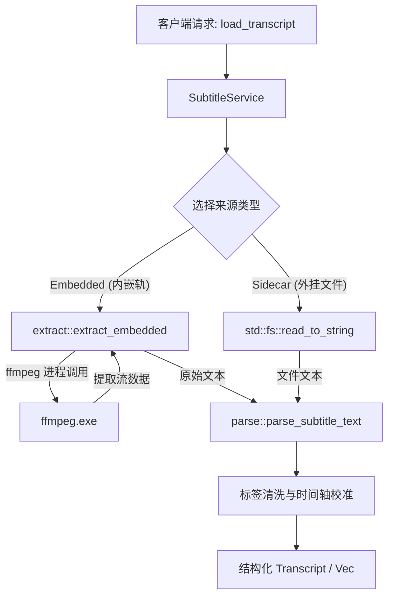

# lumina-subtitle

`lumina-subtitle` 是 Lumina 的字幕与交互文稿（Transcript）领域库。它负责视频内嵌字幕轨识别、外挂同名字幕扫描、基于 ffmpeg 的流提取、双向格式解析（SRT / WebVTT / ASS）以及结构化文稿的生成与导出。

---

## 1. 模块定位与职责

在 Lumina 架构中，`lumina-subtitle` 是构建“视频阅读器（Video Reader）”体验的核心支撑：

```text
[lumina-media] (探测底层流)
      │
      ▼
[lumina-subtitle] ◄─── [lumina-asr] (将 ASR 结果转为 Cues)
      │
      ├───────────────────────┬────────────────────────┐
      ▼                       ▼                        ▼
[lumina-notes]          [lumina-ai]              [lumina-mcp]
(按时间戳引用字幕金句)   (短任务翻译/润色 Cues)    (向 Agent 提供当前窗口文稿)
```

- **职责**：
  - 汇总视频可用的所有字幕轨道：内嵌字幕流（`Embedded`）与同目录下外挂字幕（`Sidecar`，如 `.srt`、`.vtt`、`.ass`）。
  - 识别图形位图字幕（如 PGS/DVDSub 等不可转文本格式）并进行降级标注。
  - 使用 `ffmpeg` 将内嵌文本字幕轨无损转存提取为标准文本。
  - 高容错解析 SRT 与 WebVTT 格式，过滤 HTML/样式标签，构建标准化的 `Cue` 序列与 `Transcript`。
  - 提供字幕重命名、格式转换（转 SRT/VTT）与本地落盘写入（`write`）功能。
- **硬约束**：
  - 不做网络请求，不依赖在线翻译 API。
  - 文本清洗确保移除特殊渲染代码（如 ASS 的 `{\an8}`、HTML `<i>...</i>`），为下游 AI/MCP 准备纯净上下文。

---

## 2. 构建思路与设计原则

1. **统一的文稿抽象（Standard Transcript & Cue Model）**：
   - 无论是来自视频内嵌轨、外挂字幕文件、离线 ASR 识别结果，还是在线 YouTube 自动字幕，最终全部转化为统一的 `Transcript` 和 `Vec<Cue>` 结构。每个 `Cue` 精确包含毫秒级 `start_ms`、`end_ms` 与清洗后的纯净 `text`。
2. **渐进降级与鲁棒解析（Robust Fallback Parsing）**：
   - 字幕来源繁杂，常见时间戳格式不规范、编码混乱（UTF-8 / GBK / UTF-16 BOM）或包含样式富文本。`parse` 模块实现了高度容错的断句和时间解析逻辑，最大程度挽救残损字幕。
3. **依赖下沉（Clean Dependency Hierarchy）**：
   - 依赖 `lumina-media` 进行流信息探测，但自身完全不感知播放器 `libmpv`，也不依赖上层 AI 或笔记模块。

---

## 3. 对外使用指南

### 在 Cargo workspace 中添加依赖

```toml
[dependencies]
lumina-subtitle.workspace = true
```

### 代码使用示例

#### 1. 列出可供选择的全部字幕轨并加载

```rust
use std::path::Path;
use lumina_subtitle::{SubtitleService, SubtitleChoice};

let video_path = Path::new("D:/Movies/interstellar.mkv");

// 列出所有可用字幕（包括容器内嵌轨 + 同目录下的 interstellar.zh.srt 等外挂）
let choices: Vec<SubtitleChoice> = SubtitleService::list_choices(video_path)?;
for choice in &choices {
    println!("选项: id={}, 描述={}, 是否支持文本提取={}", choice.id, choice.label, choice.supported);
}

// 加载指定选项目标
if let Some(target) = choices.into_iter().find(|c| c.supported) {
    let transcript = SubtitleService::load_transcript(video_path, &target.id, None)?;
    println!("文稿总句数: {}", transcript.cues.len());
    for cue in transcript.cues.iter().take(3) {
        println!("[{:.2}s -> {:.2}s] {}", cue.start_ms as f64 / 1000.0, cue.end_ms as f64 / 1000.0, cue.text);
    }
}
```

#### 2. 将字幕段落写入/导出为 SRT 文件

```rust
use std::path::Path;
use lumina_subtitle::{write, Cue};

let cues = vec![
    Cue { start_ms: 1000, end_ms: 3500, text: "这是第一句对话".into() },
    Cue { start_ms: 4000, end_ms: 6200, text: "这是第二句对话".into() },
];

write::write_srt_file(Path::new("D:/Movies/export.srt"), &cues)?;
```

---

## 4. 内部子模块全景

`lumina-subtitle/src/` 的主要实现模块如下；列表聚焦稳定的核心文件，内部辅助文件可随实现调整：

| 源码文件 | 模块名称 | 核心职责与导出项 |
| :--- | :--- | :--- |
| [`lib.rs`](./lib.rs) | 根模块 | 重新导出公开接口；定义字幕领域依赖边界。 |
| [`service.rs`](./service.rs) | `service` | • `SubtitleService`: 提供 `list_choices`（探测所有内嵌与外挂字幕）和 `load_transcript`（按选项 ID 加载解析）。 |
| [`model.rs`](./model.rs) | `model` | • `Cue`: 单句字幕（起止毫秒与文本）。<br>• `Transcript`: 整份文稿容器。<br>• `SubtitleChoice`: 可供用户选择的字幕选项。<br>• `SubtitleSource`: `Embedded` / `Sidecar` / `Asr` / `Ytdl`。 |
| [`parse.rs`](./parse.rs) | `parse` | • 解析 SRT、VTT 及通用字幕文本。<br>• 时间戳正则匹配与转换。<br>• HTML 标签与特效代码清洗。 |
| [`extract.rs`](./extract.rs) | `extract` | • 调用 `ffmpeg -i ... -map 0:s:{idx}` 将内嵌文本字幕轨抽取为文本。<br>• 判断是否为位图编码（`is_bitmap_codec`，如 `hdmv_pgs_subtitle`）。 |
| [`write.rs`](./write.rs) | `write` | 将内存中的 `Vec<Cue>` 格式化并安全原子落盘写入为标准 `.srt` 或 `.vtt` 文件。 |
| [`error.rs`](./error.rs) | `error` | • `SubtitleError` 与 `SubtitleErrorCode`（`FileNotFound`, `ExtractFailed`, `ParseFailed` 等）。 |

---

## 5. 核心协作与数据流向


