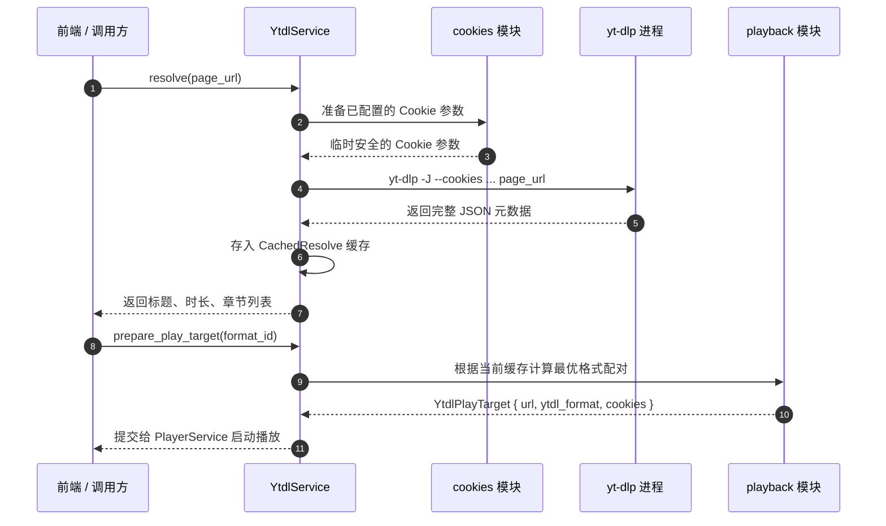

# lumina-ytdl

`lumina-ytdl` 是 Lumina 的在线流媒体解析与工具集成领域库。它封装了对 `yt-dlp` 的全生命周期管理，提供在线视频元数据解析、多分辨率清晰度优选、多浏览器 Cookie 安全注入、在线字幕自动抽取与可执行程序自动更新等能力。

---

## 1. 模块定位与职责

在 Lumina 架构中，`lumina-ytdl` 负责打通从公网流媒体 URL 到播放器可播放目标的转换链路：

```text
[用户输入在线 URL] (如 YouTube / Bilibili)
        │
        ▼
  [lumina-ytdl] ──(调度解析与 Cookie)──► yt-dlp CLI
        │
        ├───────────────────────┬────────────────────────┐
        ▼                       ▼                        ▼
[lumina-core::MediaSource] [lumina-player]         [lumina-subtitle]
(生成稳定的 Remote 标识)    (提供直链与格式参数给 mpv) (拉取并缓存在线字幕)
```

- **职责**：
  - 在线流媒体解析（`resolve`）：无需下载整视频，高速提取视频标题、作者、时长、章节列表、所有可用画质流及内嵌/自动字幕。
  - 清晰度决策（`playback`）：组合最佳视频轨与音频轨（如 1080p + 优质音频），构造供 `libmpv` 直接播放的 `YtdlPlayTarget`。
  - 浏览器 Cookie 鉴权（`cookies`）：支持从 Chrome、Edge、Firefox、Brave 等本地浏览器或 `cookies.txt` 安全提取凭证，以观看高画质、会员或年龄限制视频。
  - 在线字幕转储（`subtitle`）：将远程字幕（WebVTT / JSON3）拉取并缓存转换为 `lumina-subtitle` 兼容的统一文稿。
  - 自动更新维护（`download`）：内置官方版本检查、二进制流式下载与 SHA-256 完整性验证。
- **硬约束**：
  - 脱敏安全原则：绝不将完整的 Cookie 凭据、私有签名 URL 记录到日志或暴露给前端 UI。
  - 启动时纯惰性：不主动连接网络或在无网络时阻断本地功能。

---

## 2. 构建思路与设计原则

1. **分离“解析元数据”与“下载视频”（Metadata Resolution vs. Video Fetching）**：
   - Lumina 是实时视频阅读器而非离线下载器。`lumina-ytdl` 仅利用 `yt-dlp -J` 进行流地址与元信息解析，将真实的媒体流拉取和解封装全权移交给底层的 `libmpv` 网络管线。
2. **解析结果带锁缓存（Resolve Cache）**：
   - 外部流解析需要 1~3 秒网络握手。解析后，视频标题、可选画质、分段章节和已解析字幕全部缓存在 `YtdlService` 内存中，后续用户在前端切换分辨率或打开字幕面板时能获得零延迟响应。
3. **JS 运行时环境感知（JS Runtime Detection）**：
   - 现代在线视频平台（特别是 YouTube 的 n-sig 算法）需要 JavaScript 运行时辅助解密签名。`runtime` 模块自动嗅探系统环境中的 Node.js、Bun、Deno 或 QuickJS，并传递给 yt-dlp，确保高成功率解析。

---

## 3. 对外使用指南

### 添加依赖

```toml
[dependencies]
lumina-ytdl = { path = "../lumina-ytdl" }
```

### 代码使用示例

#### 1. 解析在线视频并选择最高画质播放

```rust
use lumina_ytdl::YtdlService;

let ytdl = YtdlService::new();
let url = "https://www.youtube.com/watch?v=ba024k169s";

// 异步/同步解析元数据
let result = ytdl.resolve(url)?;
println!("视频标题: {}", result.title);
println!("时长: {:.1}s", result.duration);

// 获取可选画质列表
let formats = ytdl.list_playback_formats()?;
for fmt in &formats.formats {
    println!("画质选项: {} ({})", fmt.label, fmt.format_id);
}

// 构造供播放器加载的目标
let play_target = ytdl.prepare_play_target(url, None)?;
println!("播放器加载参数: URL={}, 格式设置={}", play_target.url, play_target.ytdl_format);
```

#### 2. 拉取并缓存该在线视频的字幕

```rust
let tracks = ytdl.list_subtitles(url)?;
if let Some(track) = tracks.first() {
    let transcript = ytdl.load_subtitle_transcript(url, &track.id)?;
    println!("在线字幕已加载，共 {} 句", transcript.cues.len());
}
```

---

## 4. 内部子模块全景

`lumina-ytdl/src/` 包含以下 11 个源码模块：

| 源码文件 | 模块名称 | 核心职责与导出项 |
| :--- | :--- | :--- |
| [`lib.rs`](file:///d:/project/rust/tauri/lumina/crates/lumina-ytdl/src/lib.rs) | 根模块 | 重新导出公开接口；声明依赖边界。 |
| [`service.rs`](file:///d:/project/rust/tauri/lumina/crates/lumina-ytdl/src/service.rs) | `service` | • `YtdlService`: 统一对外业务门面，包含解析缓存与互斥并发锁。 |
| [`resolve.rs`](file:///d:/project/rust/tauri/lumina/crates/lumina-ytdl/src/resolve.rs) | `resolve` | 拼接命令行参数调用 `yt-dlp --dump-single-json`，反序列化原始视频与音轨数据。 |
| [`playback.rs`](file:///d:/project/rust/tauri/lumina/crates/lumina-ytdl/src/playback.rs) | `playback` | 决策与合并音视频流（`bestvideo+bestaudio`），生成供 mpv 使用的 `YtdlPlayTarget`。 |
| [`cookies.rs`](file:///d:/project/rust/tauri/lumina/crates/lumina-ytdl/src/cookies.rs) | `cookies` | 读取各浏览器 Profile、测试 Cookie 有效性、隔离生成供 yt-dlp 读取的临时脱敏凭证。 |
| [`subtitle.rs`](file:///d:/project/rust/tauri/lumina/crates/lumina-ytdl/src/subtitle.rs) | `subtitle` | 下载远程字幕源（VTT / JSON3），转换为统一的 `lumina_subtitle::Transcript` 结构。 |
| [`download.rs`](file:///d:/project/rust/tauri/lumina/crates/lumina-ytdl/src/download.rs) | `download` | 从 GitHub Releases 拉取最新稳定版 `yt-dlp.exe`，执行 SHA-256 校验和原子覆写。 |
| [`runtime.rs`](file:///d:/project/rust/tauri/lumina/crates/lumina-ytdl/src/runtime.rs) | `runtime` | 检测系统安装的 JS 引擎（Node.js / Bun / Deno / QuickJS），提升 YouTube 解密稳定性。 |
| [`provider.rs`](file:///d:/project/rust/tauri/lumina/crates/lumina-ytdl/src/provider.rs) | `provider` | `SubtitleProvider` 抽象策略接口，实现字幕语言代号标准化（如 `zh-Hans` -> `zh`）。 |
| [`paths.rs`](file:///d:/project/rust/tauri/lumina/crates/lumina-ytdl/src/paths.rs) | `paths` | 解析 yt-dlp 本地存放路径、Cookie 缓存文件位置与系统环境变量。 |
| [`model.rs`](file:///d:/project/rust/tauri/lumina/crates/lumina-ytdl/src/model.rs) | `model` | • `YtdlResolveResult`, `YtdlFormat`, `YtdlSubtitleTrack`, `YtdlStatus`, `YtdlInstallEvent`。 |
| [`error.rs`](file:///d:/project/rust/tauri/lumina/crates/lumina-ytdl/src/error.rs) | `error` | • `YtdlError` 与 `YtdlErrorCode`（`BinaryNotFound`, `ResolveFailed`, `NetworkError` 等）。 |

---

## 5. 核心协作与数据流向


